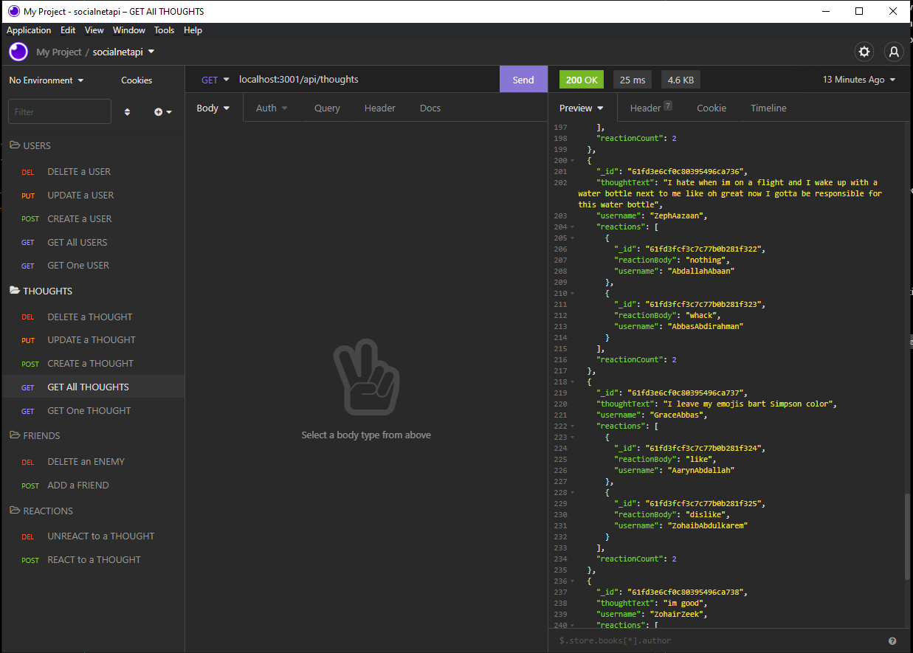

# **
 NoSQL-SocialNetworkAPI 
**

## **Contents**
- [Description](#description)
- [Technologies](#technologies)
- [The Recipe](#the-recipe)
- [License](#license)
- [Improvements](#improvements)
- [Shout Outs](#shout-outs)
- [Screen Shot](#screen-shot)
- [Links](#links)

 

## **Description**
Basic Social Network API using MongoDB
  
Application can create/update/delete users, create/update/delete thoughts for a user, react/unreact to thoughts and add/delete friends.

## **Technologies**
- JavaScript
- Node.js, MongoDB
- npm dependencies: express, mongoose, moment, validator
- Computer

## **The Recipe**
1. Clone this repo to the location of your choice
2. Open your command terminal in the root folder of the repo
3. Run `npm install` to download modules and packages
4. Run `npm run seed` to seed database with data
5. Keep terminal open and open Insomnia
6. Use correct route paths and do what you want like view/create/update/delete users/thoughts/reactions/friends
7. Close and never use this again

## **Improvements**

Nothing for now I hope

## **License**

MIT License, do what you want.  
The only crime that could possibly be comitted here would be actually using this note taker

## **Shout Outs**

Shout out to the real MVP, Stack Overflow

## **Screen Shot**

## **Links**

